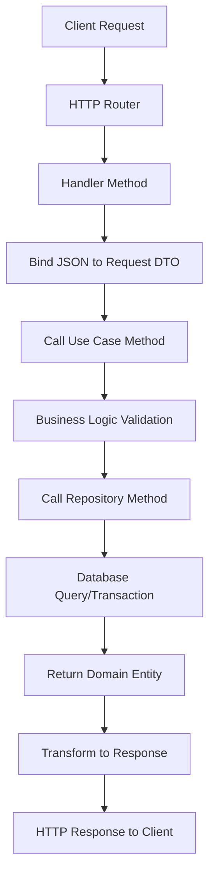
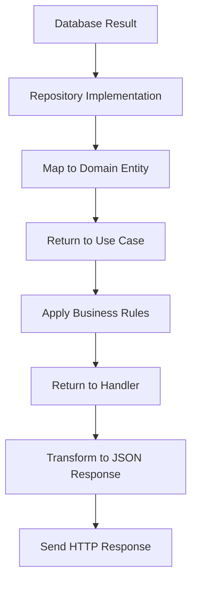
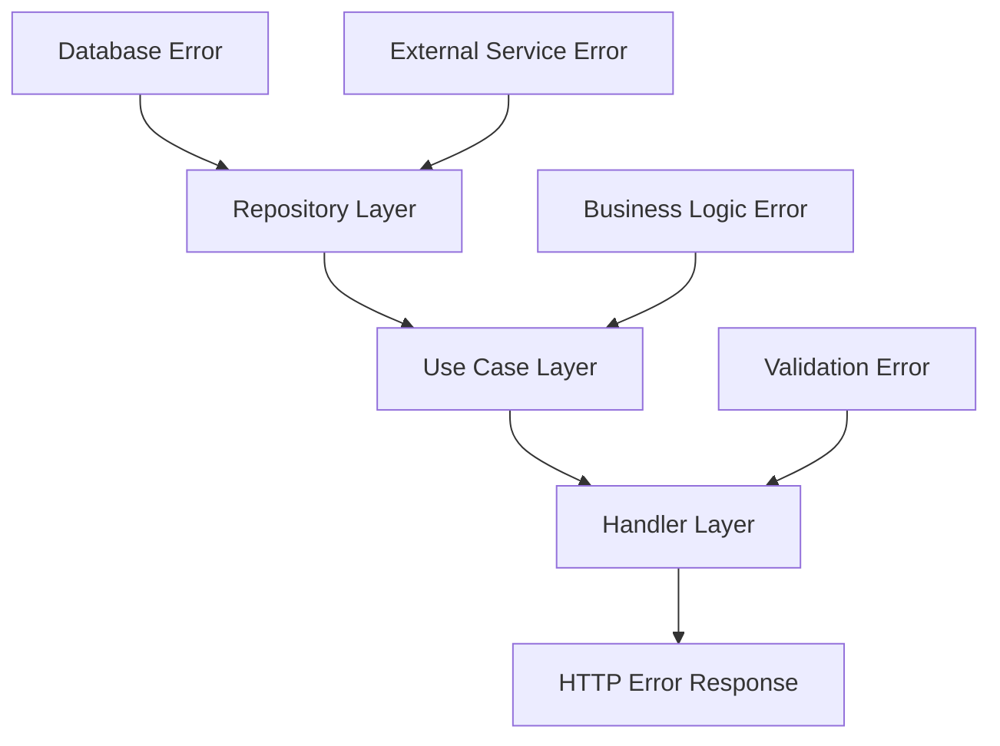

# 🔄 Backend Data Flow Documentation

เอกสารอธิบายการไหลของข้อมูลใน Backend ที่ใช้ Clean Architecture

## 📋 Table of Contents
- [Overview](#overview)
- [Architecture Layers](#architecture-layers)
- [Request Flow](#request-flow)
- [Data Flow Examples](#data-flow-examples)
- [Error Handling Flow](#error-handling-flow)
- [Database Interactions](#database-interactions)

---

## 🎯 Overview

Backend นี้ใช้ **Clean Architecture** ที่แบ่งการทำงานออกเป็น 4 layers หลัก โดยข้อมูลจะไหลจากภายนอกเข้าสู่ภายในผ่าน interfaces และไหลกลับออกมาในทิศทางเดียวกัน

```
📱 Client Request
     ↓
🌐 HTTP Handler (Delivery Layer)
     ↓
📋 Use Case (Business Logic Layer)
     ↓
🔥 Domain Entity (Domain Layer)
     ↓
🗄️ Repository (Infrastructure Layer)
     ↓
💾 Database
```

---

## 🏗️ Architecture Layers

### 1. **🌐 Delivery Layer** (`internal/delivery/http/`)
**หน้าที่:** รับ HTTP requests และส่ง responses
- **Input:** HTTP Request (JSON)
- **Output:** HTTP Response (JSON)
- **Components:**
  - Router (`router.go`)
  - Handlers (`user/`, `product/`, `order/`)

### 2. **📋 Use Case Layer** (`internal/usecase/`)
**หน้าที่:** Business logic และ orchestration
- **Input:** Request DTOs จาก Delivery Layer
- **Output:** Domain entities หรือ errors
- **Components:**
  - Interfaces (`usecase.go`)
  - Implementations (`service.go`)

### 3. **🔥 Domain Layer** (`internal/domain/`)
**หน้าที่:** Core business entities และ rules
- **Input/Output:** Pure domain objects
- **Components:**
  - Models (`model.go`)
  - Repository Interfaces (`repository.go`)

### 4. **🗄️ Infrastructure Layer** (`internal/repository/`)
**หน้าที่:** Data persistence และ external services
- **Input:** Domain entities
- **Output:** Persisted data หรือ retrieved entities
- **Components:**
  - Repository Implementations (`postgres.go`)

---

## 🔄 Request Flow

### 📥 **Inbound Flow (Client → Database)**



### 📤 **Outbound Flow (Database → Client)**



---

## 📚 Data Flow Examples

### 🔐 **Example 1: Create User Flow**

#### **Step-by-step Process:**

```
1. 📱 Client POST /api/v1/users
   ├── Body: {"username": "john", "email": "john@example.com", "password": "123456", "role": "user"}
   
2. 🌐 HTTP Handler (user/handler.go:CreateUser)
   ├── c.ShouldBindJSON(&req) // Bind to CreateUserRequest
   ├── Validate request format
   
3. 📋 Use Case (user/service.go:CreateUser)
   ├── Check username exists: userRepo.ExistsByUsername(ctx, req.Username)
   ├── Check email exists: userRepo.ExistsByEmail(ctx, req.Email)
   ├── Hash password: bcrypt.GenerateFromPassword([]byte(req.Password))
   ├── Create entity: &user.User{ID: uuid.New(), Username: req.Username, ...}
   
4. 🔥 Domain Entity (user/model.go:User)
   ├── Validate business rules
   ├── Set timestamps and UUID
   
5. 🗄️ Repository (user/postgres.go:Create)
   ├── db.WithContext(ctx).Create(user)
   ├── Execute SQL INSERT
   
6. 💾 Database
   ├── Store user record
   ├── Return created record
   
7. 📤 Response Flow
   ├── Entity → Use Case (remove password)
   ├── Use Case → Handler
   ├── Handler → JSON Response
   ├── Status: 201 Created
```

#### **Data Transformation:**

```go
// 1. HTTP Request DTO
type CreateUserRequest struct {
    Username string    `json:"username"`
    Email    string    `json:"email"`
    Password string    `json:"password"`
    Role     UserRole  `json:"role"`
}

// 2. Domain Entity
type User struct {
    ID        uuid.UUID `json:"id"`
    Username  string    `json:"username"`
    Email     string    `json:"email"`
    Password  string    `json:"-"`        // Hidden in response
    Role      UserRole  `json:"role"`
    IsActive  bool      `json:"is_active"`
    CreatedAt time.Time `json:"created_at"`
    UpdatedAt time.Time `json:"updated_at"`
}

// 3. HTTP Response
{
    "id": "123e4567-e89b-12d3-a456-426614174000",
    "username": "john",
    "email": "john@example.com",
    "role": "user",
    "is_active": true,
    "created_at": "2024-01-01T10:00:00Z",
    "updated_at": "2024-01-01T10:00:00Z"
}
```

---

### 🛒 **Example 2: Create Order Flow**

#### **Complex Business Logic Flow:**

```
1. 📱 Client POST /api/v1/orders
   ├── Body: {
   │    "user_id": "user-uuid",
   │    "order_items": [
   │        {"product_id": "product-uuid", "quantity": 2}
   │    ]
   │   }
   
2. 🌐 HTTP Handler (order/handler.go:CreateOrder)
   ├── Bind request to CreateOrderRequest
   
3. 📋 Use Case (order/service.go:CreateOrder)
   ├── Validate user exists: userRepo.Exists(ctx, req.UserID)
   ├── For each order item:
   │   ├── Get product: productRepo.GetByID(ctx, itemReq.ProductID)
   │   ├── Check stock: product.IsInStock(itemReq.Quantity)
   │   ├── Calculate subtotal: quantity * price
   │   ├── Deduct stock: product.DeductStock(itemReq.Quantity)
   │   ├── Update product: productRepo.Update(ctx, product)
   ├── Calculate total price
   ├── Create order entity
   
4. 🔥 Domain Entities
   ├── Order entity with calculated total
   ├── OrderItem entities with subtotals
   ├── Business rules validation
   
5. 🗄️ Repository Transaction
   ├── Begin database transaction
   ├── Create order: orderRepo.Create(ctx, order)
   ├── Update product stocks
   ├── Commit transaction
   
6. 💾 Database
   ├── Insert into orders table
   ├── Insert into order_items table
   ├── Update products table (stock)
   
7. 📤 Response
   ├── Return complete order with items
   ├── Include product details (via preload)
   ├── Status: 201 Created
```

#### **Transaction Handling:**

```go
// Pseudo-code for transaction flow
func (s *service) CreateOrder(ctx context.Context, req *CreateOrderRequest) (*order.Order, error) {
    // 1. Validate user
    if exists, err := s.userRepo.Exists(ctx, req.UserID); !exists {
        return nil, ErrUserNotFound
    }
    
    // 2. Process each item (critical section)
    for _, itemReq := range req.OrderItems {
        product, err := s.productRepo.GetByID(ctx, itemReq.ProductID)
        if err != nil {
            return nil, ErrProductNotFound
        }
        
        // Business rule: Check stock availability
        if !product.IsInStock(itemReq.Quantity) {
            return nil, ErrInsufficientStock
        }
        
        // Apply business logic: Deduct stock
        product.DeductStock(itemReq.Quantity)
        
        // Update in database
        if err := s.productRepo.Update(ctx, product); err != nil {
            return nil, ErrDatabaseError
        }
    }
    
    // 3. Create order
    return s.orderRepo.Create(ctx, order)
}
```

---

## ⚠️ Error Handling Flow

### **Error Propagation:**



### **Error Categories:**

#### **1. 🗄️ Repository Layer Errors**
```go
// Database connection errors
if err := db.Create(&user).Error; err != nil {
    return ErrDatabaseError
}
```

#### **2. 📋 Use Case Layer Errors**
```go
// Business logic errors
if !product.IsInStock(quantity) {
    return ErrInsufficientStock
}

if exists, _ := s.userRepo.ExistsByEmail(ctx, email); exists {
    return ErrUserAlreadyExists
}
```

#### **3. 🌐 Handler Layer Errors**
```go
// HTTP-specific errors
if err := c.ShouldBindJSON(&req); err != nil {
    c.JSON(http.StatusBadRequest, gin.H{"error": err.Error()})
    return
}

// Map business errors to HTTP status codes
switch err {
case user.ErrUserNotFound:
    c.JSON(http.StatusNotFound, gin.H{"error": err.Error()})
case user.ErrUserAlreadyExists:
    c.JSON(http.StatusConflict, gin.H{"error": err.Error()})
default:
    c.JSON(http.StatusInternalServerError, gin.H{"error": err.Error()})
}
```

---

## 💾 Database Interactions

### **GORM Auto-Migration Flow:**

```go
// At application startup (main.go)
if err := db.AutoMigrate(
    &user.User{}, 
    &product.Product{}, 
    &order.Order{}, 
    &order.OrderItem{}
); err != nil {
    log.Fatal("Failed to migrate database:", err)
}
```

### **Query Examples:**

#### **Simple Query (Repository):**
```go
func (r *postgresRepository) GetByID(ctx context.Context, id uuid.UUID) (*user.User, error) {
    var u user.User
    err := r.db.WithContext(ctx).Where("id = ?", id).First(&u).Error
    return &u, err
}
```

#### **Complex Query with Preloading:**
```go
func (r *postgresRepository) GetByID(ctx context.Context, id uuid.UUID) (*order.Order, error) {
    var o order.Order
    err := r.db.WithContext(ctx).
        Preload("User").                    // Join users table
        Preload("OrderItems").              // Join order_items table
        Preload("OrderItems.Product").      // Join products table through order_items
        Where("id = ?", id).
        First(&o).Error
    return &o, err
}
```

### **Generated SQL Examples:**

#### **Create User:**
```sql
INSERT INTO users (id, username, email, password, role, is_active, created_at, updated_at) 
VALUES ($1, $2, $3, $4, $5, $6, $7, $8)
```

#### **Get Order with Relations:**
```sql
-- Main query
SELECT * FROM orders WHERE id = $1;

-- Preload User
SELECT * FROM users WHERE id IN (order.user_id);

-- Preload OrderItems
SELECT * FROM order_items WHERE order_id = $1;

-- Preload Products through OrderItems
SELECT * FROM products WHERE id IN (order_items.product_id);
```

---

## 🔁 Data Flow Patterns

### **1. Repository Pattern:**
```go
// Interface in Domain Layer
type Repository interface {
    Create(ctx context.Context, entity *Entity) error
    GetByID(ctx context.Context, id uuid.UUID) (*Entity, error)
}

// Implementation in Infrastructure Layer
type postgresRepository struct {
    db *gorm.DB
}
```

### **2. Dependency Injection:**
```go
// main.go - Wire dependencies
userRepository := userRepo.NewPostgresRepository(db)
userService := userUseCase.NewService(userRepository)
userHandler := userHandler.NewHandler(userService)
```

### **3. Context Propagation:**
```go
// Context flows through all layers
func (h *Handler) CreateUser(c *gin.Context) {
    // Extract context from HTTP request
    ctx := c.Request.Context()
    
    // Pass context to use case
    user, err := h.userUseCase.CreateUser(ctx, &req)
    
    // Use case passes to repository
    err = s.userRepo.Create(ctx, user)
    
    // Repository uses context for database operations
    err = r.db.WithContext(ctx).Create(user).Error
}
```

---

## 📊 Performance Considerations

### **Connection Pooling:**
```go
// Database configuration
sqlDB, _ := db.DB()
sqlDB.SetMaxIdleConns(5)           // Idle connections
sqlDB.SetMaxOpenConns(25)          // Max connections
sqlDB.SetConnMaxLifetime(300 * time.Second)  // Connection lifetime
```

### **Query Optimization:**
- **Preloading** สำหรับ related data
- **Indexing** บน foreign keys และ query fields
- **Pagination** สำหรับ list operations
- **Select specific fields** แทนการ select ทั้งหมด

### **Caching Strategy:**
```go
// Potential caching points
func (s *service) GetProductByID(ctx context.Context, id uuid.UUID) (*product.Product, error) {
    // 1. Check cache first
    if cached := cache.Get(fmt.Sprintf("product:%s", id)); cached != nil {
        return cached.(*product.Product), nil
    }
    
    // 2. Fetch from database
    p, err := s.productRepo.GetByID(ctx, id)
    if err != nil {
        return nil, err
    }
    
    // 3. Store in cache
    cache.Set(fmt.Sprintf("product:%s", id), p, 5*time.Minute)
    
    return p, nil
}
```

---

## 🎯 Summary

การไหลของข้อมูลใน Backend นี้ออกแบบมาให้:

1. **🔄 Unidirectional Flow** - ข้อมูลไหลทิศทางเดียว ทำให้ง่ายต่อการ debug
2. **🧪 Testable** - แต่ละ layer สามารถ test แยกได้
3. **🔧 Maintainable** - แยก concerns ชัดเจน แก้ไขง่าย
4. **📈 Scalable** - เพิ่ม features ใหม่โดยไม่กระทบของเก่า
5. **🔒 Secure** - Business rules อยู่ใน Use Case Layer ไม่หลุดออกมา

**Key Principle:** *Dependencies point inward* - Layer ภายนอกขึ้นอยู่กับ layer ภายใน ไม่ใช่ตรงกันข้าม